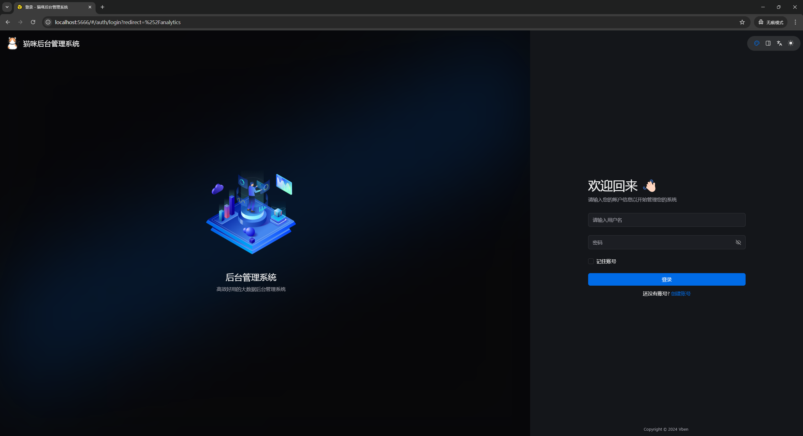
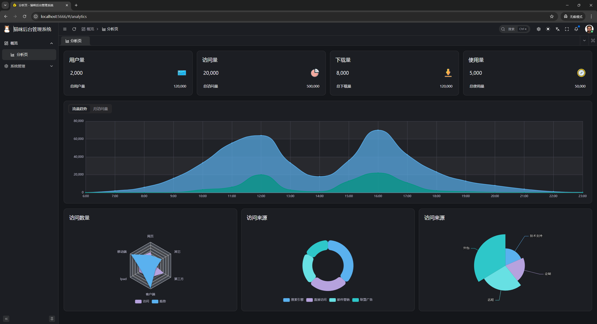
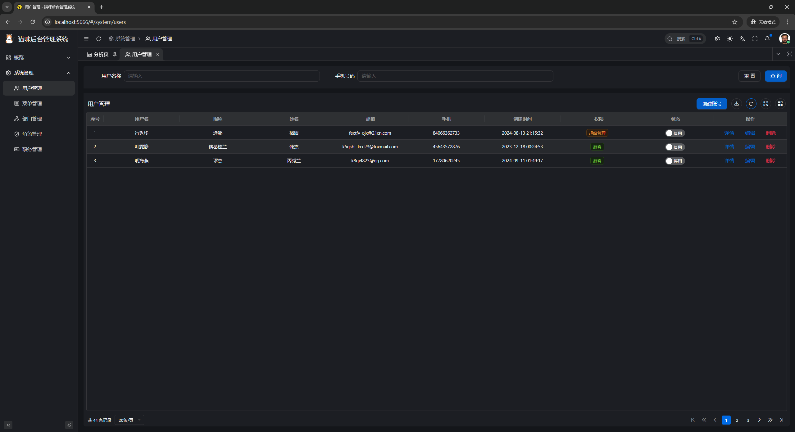
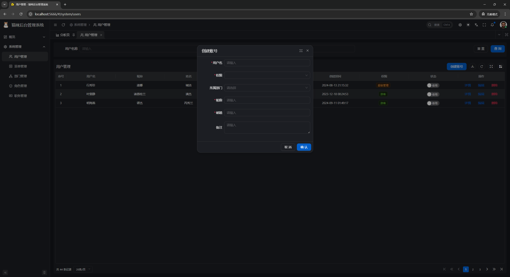

# Golang微服务框架Kratos单体应用模板

> 道德经  
> 道生一，一生二，二生三，三生万物
 
一个微服务项目，它有可能只有一个服务，也有可能有两个，也有可能三个，更有可能有无数个。

但，万物之始，必有一。

## 技术栈

- 后端基于 [Golang](https://go.dev/) + [go-kratos](https://go-kratos.dev/) + [wire](https://github.com/google/wire) + [ent](https://entgo.io/docs/getting-started/)
- 前端基于 [Vue](https://vuejs.org/) + [TypeScript](https://www.typescriptlang.org/) + [Ant Design Vue](https://antdv.com/) + [Vben Admin](https://doc.vben.pro/)

## 后台截图

